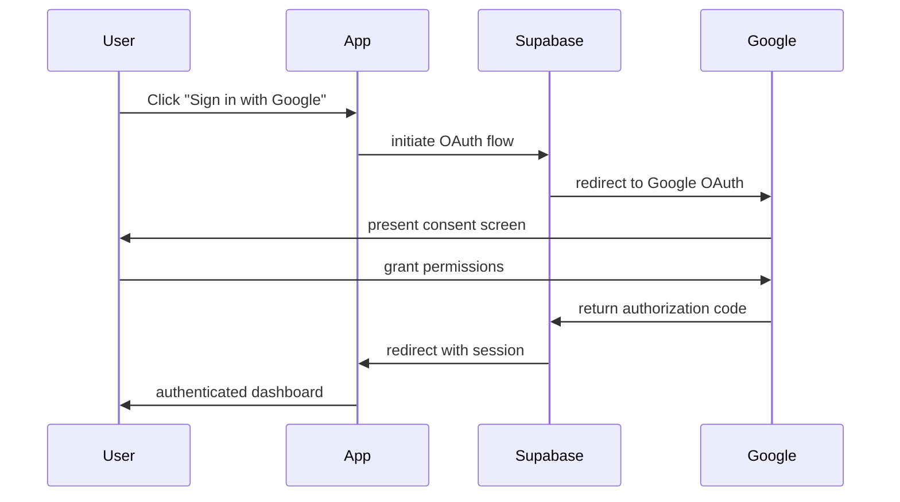
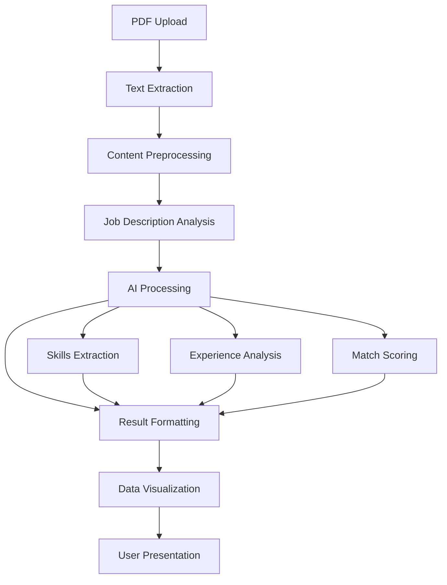

# Design Document

## Overview

This design document outlines the comprehensive modernization of the Resume Analyzer application, transforming it from a functional but basic interface into a polished, high-performance product. The modernization focuses on five key areas: modern UI/UX design, Google authentication integration, backend performance optimization, frontend performance enhancement, and an engaging landing page.

The design leverages the existing Next.js 15 + React 19 architecture while upgrading the UI components to use a proper shadcn/ui implementation, implementing advanced performance optimizations, and creating a cohesive brand experience.

## Architecture

### Current State Analysis
- **Framework**: Next.js 15.3.5 with App Router
- **Styling**: Tailwind CSS 4.1.11 with basic custom components
- **Authentication**: Supabase email/password only
- **UI Components**: Basic custom implementations
- **Performance**: No optimization strategies implemented

### Target Architecture
- **Enhanced UI System**: Full shadcn/ui component library with custom theming
- **Multi-Auth System**: Supabase with Google OAuth integration
- **Performance Layer**: Frontend and backend optimization strategies
- **Modern Design System**: Consistent branding, animations, and responsive design

## Components and Interfaces

### 1. Modern UI Design System

#### Design Principles
- **Minimalist Aesthetic**: Clean, uncluttered interfaces with purposeful whitespace
- **Consistent Typography**: Hierarchical text system using Inter font family
- **Color Psychology**: Professional blue-based palette with accent colors for engagement
- **Micro-interactions**: Subtle animations that provide feedback and delight
- **Accessibility First**: WCAG 2.1 AA compliance with proper contrast and keyboard navigation

#### Component Architecture
```typescript
// Enhanced shadcn/ui components with custom variants
interface DesignSystem {
  components: {
    Button: {
      variants: ['default', 'destructive', 'outline', 'secondary', 'ghost', 'link']
      sizes: ['default', 'sm', 'lg', 'icon']
      animations: ['hover', 'press', 'loading']
    }
    Card: {
      variants: ['default', 'elevated', 'outlined', 'glass']
      layouts: ['default', 'compact', 'feature']
    }
    Input: {
      states: ['default', 'error', 'success', 'loading']
      variants: ['default', 'search', 'file']
    }
  }
  animations: {
    transitions: 'smooth 200ms ease-in-out'
    loading: 'pulse, skeleton, spinner'
    feedback: 'success, error, warning'
  }
}
```

#### Visual Hierarchy
- **Primary Actions**: Prominent buttons with gradient backgrounds
- **Secondary Actions**: Outlined buttons with hover states
- **Content Cards**: Elevated surfaces with subtle shadows
- **Data Visualization**: Progress bars, score indicators, and charts for analysis results

### 2. Google Authentication Integration

#### OAuth Flow Design


#### Authentication UI Components
- **Unified Login Page**: Both email and Google options with visual parity
- **Social Login Button**: Branded Google button following design guidelines
- **Profile Management**: User avatar, name, and account settings
- **Session Management**: Automatic token refresh and secure logout

### 3. Enhanced Landing Page

#### Page Structure
```typescript
interface LandingPageSections {
  hero: {
    headline: string
    subheadline: string
    cta: 'primary' | 'secondary'
    backgroundVideo?: string
  }
  features: {
    title: string
    items: FeatureCard[]
    layout: 'grid' | 'carousel'
  }
  howItWorks: {
    steps: ProcessStep[]
    visualization: 'timeline' | 'cards'
  }
  testimonials: {
    reviews: Testimonial[]
    layout: 'carousel' | 'grid'
  }
  pricing: {
    tiers: PricingTier[]
    highlight: 'free' | 'premium'
  }
  footer: {
    links: FooterSection[]
    social: SocialLink[]
  }
}
```

#### Content Strategy
- **Value Proposition**: "Get AI-powered resume feedback in seconds"
- **Social Proof**: User testimonials and success metrics
- **Feature Highlights**: Visual demonstrations of analysis capabilities
- **Trust Signals**: Security badges, privacy policy, terms of service

### 4. Performance Optimization Architecture

#### Frontend Performance
```typescript
interface PerformanceStrategy {
  codeOptimization: {
    bundleSplitting: 'route-based' | 'component-based'
    lazyLoading: 'components' | 'images' | 'data'
    treeshaking: 'automatic'
  }
  caching: {
    staticAssets: 'CDN + browser cache'
    apiResponses: 'SWR with revalidation'
    userData: 'localStorage + session'
  }
  rendering: {
    strategy: 'hybrid SSR/CSR'
    streaming: 'React 18 Suspense'
    prefetching: 'next/link + intersection observer'
  }
}
```

#### Backend Performance
```typescript
interface BackendOptimization {
  database: {
    indexing: 'user_id, created_at composite indexes'
    connectionPooling: 'Supabase managed'
    queryOptimization: 'select specific fields only'
  }
  fileProcessing: {
    pdfParsing: 'streaming with worker threads'
    textExtraction: 'chunked processing'
    errorHandling: 'graceful degradation'
  }
  aiIntegration: {
    requestBatching: 'multiple analyses in single call'
    responseStreaming: 'real-time result updates'
    caching: 'similar job description results'
  }
}
```

### 5. Enhanced AI Analysis System

#### Analysis Pipeline


#### Enhanced Analysis Features
- **Detailed Skill Mapping**: Present vs. missing skills with visual indicators
- **Experience Relevance**: Timeline analysis and role progression insights
- **Industry-Specific Feedback**: Tailored recommendations by job sector
- **Improvement Prioritization**: Ranked suggestions by impact potential
- **Competitive Analysis**: How resume compares to market standards

## Data Models

### Enhanced Analysis Result Schema
```typescript
interface EnhancedAnalysisResult {
  id: string
  user_id: string
  created_at: string
  updated_at: string
  
  // Job Information
  job_title: string
  job_description: string
  job_industry?: string
  job_level?: 'entry' | 'mid' | 'senior' | 'executive'
  
  // Analysis Results
  overall_score: number // 0-100
  detailed_scores: {
    skills_match: number
    experience_relevance: number
    education_fit: number
    keyword_optimization: number
  }
  
  // Detailed Feedback
  strengths: AnalysisPoint[]
  improvements: AnalysisPoint[]
  missing_skills: Skill[]
  present_skills: Skill[]
  
  // Recommendations
  priority_actions: ActionItem[]
  industry_insights: string[]
  
  // Metadata
  processing_time: number
  ai_model_version: string
  confidence_score: number
}

interface AnalysisPoint {
  category: 'skills' | 'experience' | 'education' | 'format'
  title: string
  description: string
  impact: 'high' | 'medium' | 'low'
  examples?: string[]
}

interface Skill {
  name: string
  category: 'technical' | 'soft' | 'industry'
  proficiency?: 'beginner' | 'intermediate' | 'advanced'
  importance: number // 1-10
}

interface ActionItem {
  title: string
  description: string
  priority: number // 1-10
  estimated_impact: number // 1-10
  difficulty: 'easy' | 'medium' | 'hard'
}
```

### User Profile Enhancement
```typescript
interface EnhancedUserProfile {
  id: string
  email: string
  created_at: string
  
  // Profile Information
  full_name?: string
  avatar_url?: string
  
  // Authentication
  auth_provider: 'email' | 'google'
  google_id?: string
  
  // Preferences
  preferences: {
    theme: 'light' | 'dark' | 'system'
    notifications: boolean
    default_industry?: string
    privacy_level: 'public' | 'private'
  }
  
  // Usage Analytics
  analytics: {
    total_analyses: number
    last_active: string
    favorite_job_types: string[]
  }
}
```

## Error Handling

### Comprehensive Error Management
```typescript
interface ErrorHandlingStrategy {
  authentication: {
    googleOAuthFailure: 'fallback to email auth with clear messaging'
    sessionExpiry: 'automatic refresh with user notification'
    networkErrors: 'offline mode with sync when reconnected'
  }
  
  fileProcessing: {
    invalidPDF: 'clear error message with format requirements'
    fileSizeExceeded: 'compression suggestions and alternative options'
    corruptedFile: 'file validation with repair suggestions'
  }
  
  aiProcessing: {
    serviceUnavailable: 'queue request with estimated wait time'
    rateLimiting: 'progressive backoff with user notification'
    analysisFailure: 'partial results with retry option'
  }
  
  performance: {
    slowLoading: 'skeleton screens and progress indicators'
    networkTimeout: 'retry mechanism with exponential backoff'
    memoryIssues: 'graceful degradation and cleanup'
  }
}
```

### User Experience During Errors
- **Progressive Enhancement**: Core functionality works even with JavaScript disabled
- **Graceful Degradation**: Reduced functionality rather than complete failure
- **Clear Communication**: User-friendly error messages with actionable solutions
- **Recovery Options**: Multiple paths to resolve issues or continue workflow

## Testing Strategy

### Component Testing
```typescript
interface TestingApproach {
  unitTests: {
    components: 'React Testing Library + Jest'
    utilities: 'Jest with comprehensive coverage'
    hooks: 'React Hooks Testing Library'
  }
  
  integrationTests: {
    authentication: 'Supabase auth flow testing'
    fileUpload: 'PDF processing pipeline'
    aiAnalysis: 'Mock AI responses and error scenarios'
  }
  
  e2eTests: {
    userJourneys: 'Playwright for critical paths'
    performance: 'Lighthouse CI integration'
    accessibility: 'axe-core automated testing'
  }
  
  visualTesting: {
    components: 'Storybook with Chromatic'
    responsiveness: 'Cross-device testing'
    animations: 'Motion testing and reduced-motion support'
  }
}
```

### Performance Testing
- **Load Testing**: Concurrent user simulation
- **Stress Testing**: Resource limitation scenarios
- **Accessibility Testing**: Screen reader and keyboard navigation
- **Cross-Browser Testing**: Modern browser compatibility

## Implementation Phases

### Phase 1: UI Foundation (Week 1-2)
- Implement proper shadcn/ui components
- Create design system and theme configuration
- Update existing pages with new components
- Implement responsive design patterns

### Phase 2: Authentication Enhancement (Week 2-3)
- Configure Google OAuth in Supabase
- Update authentication components
- Implement profile management
- Add session management improvements

### Phase 3: Landing Page (Week 3-4)
- Design and implement hero section
- Create feature showcase components
- Add testimonials and social proof
- Implement call-to-action flows

### Phase 4: Performance Optimization (Week 4-5)
- Frontend optimization (code splitting, lazy loading)
- Backend optimization (database, AI processing)
- Implement caching strategies
- Add monitoring and analytics

### Phase 5: Enhanced AI Analysis (Week 5-6)
- Upgrade AI prompts and processing
- Implement detailed analysis features
- Create data visualization components
- Add export and sharing capabilities

This design provides a comprehensive roadmap for transforming the Resume Analyzer into a modern, high-performance application that delivers exceptional user experience while maintaining scalability and reliability.